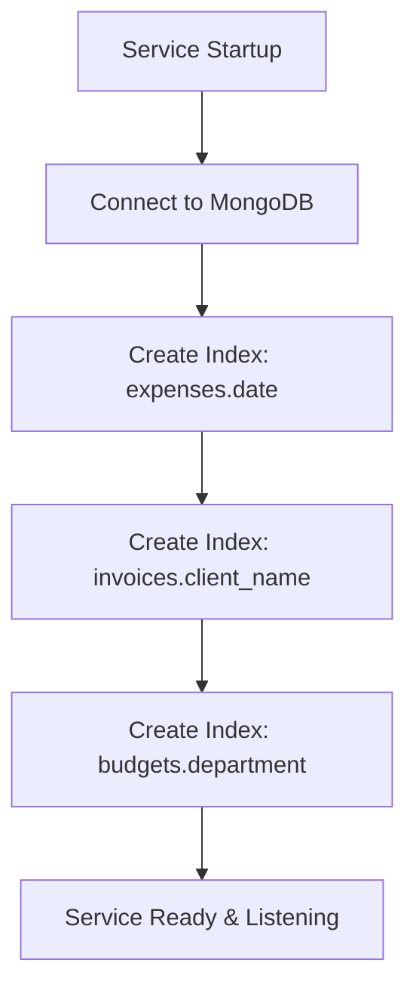

# 💰 OrganiStation Finance Service

The **Finance Service** is a core Python FastAPI microservice responsible for tracking and managing the company's financial operations, including expense reporting and approvals, department budgets, invoicing, and high-level financial summary metrics.

---

## ✨ Key Features

- **Expense Tracking & Approvals**: Allows employees to submit expense claims and managers to approve or reject them.
- **Budget Allocation**: Manages department-specific budgets (monthly or yearly allocations) to ensure financial control.
- **Invoice Management**: Tracks clients, outstanding invoices, revenue, and collection statuses (paid, pending, overdue, or cancelled).
- **Financial Analytics & Summaries**: Exposes real-time aggregated metrics:
  - Total Expenses (excluding rejected claims)
  - Total Revenue (sum of paid invoices)
  - Pending Invoices count
  - Net Balance (Revenue - Expenses)
- **Automatic Indexing**: On startup, it automatically creates indexes on `expenses.date`, `invoices.client_name`, and `budgets.department` in MongoDB to optimize query performance.
- **Cascaded User Purge**: Mapped internal endpoints accept a secure `X-Internal-Secret` header to delete all related user expenses when a user account is removed from the system.

---

## 🛠️ Technology Stack

- **Framework**: FastAPI (Python 3.10+)
- **Database**: MongoDB (via `motor` asynchronous driver)
- **Settings Management**: `python-dotenv`

---

## 📂 System Lifespan & Indexing



---

## ⚙️ Configuration & Environment Variables

Create a `.env` file in the root of the `finance-service` directory (you can copy `.env.example` as a template).

| Variable | Description | Default | Required |
| :--- | :--- | :--- | :--- |
| `PORT` | Service port | `8004` | No |
| `HOST` | Bind address | `0.0.0.0` | No |
| `MONGODB_URI` | Connection URI for MongoDB | `mongodb://localhost:27017` | Yes |
| `DB_NAME` | Database name | `organistation_finance` | No |
| `INTERNAL_SERVICE_SECRET` | Secret to authenticate internal user purge requests | `organistation_internal_secret` | Yes (in Prod) |

---

## 🚀 API Endpoints

### 📊 Financial Summary Endpoints

* **`GET /api/summary`**:
  - Compiles total revenue, total expenses, net balance, and count of pending invoices.

---

### 💳 Expense Endpoints (`/api/expenses`)

* **`GET /api/expenses`**:
  - List all expense reports (ordered newest first). Optional query filter: `submitted_by` (email).
* **`POST /api/expenses`**:
  - Submit a new expense report (default status is `pending`).
* **`PUT /api/expenses/{eid}`**:
  - Update expense fields or change status (`approved` / `rejected`).
* **`DELETE /api/expenses/{eid}`**:
  - Delete an expense report from the system.

---

### 📅 Budget Endpoints (`/api/budgets`)

* **`GET /api/budgets`**:
  - List all department budget allocations.
* **`POST /api/budgets`**:
  - Create a new budget limit for a department.

---

### 📄 Invoice Endpoints (`/api/invoices`)

* **`GET /api/invoices`**:
  - List all customer/client invoices (ordered by due date).
* **`POST /api/invoices`**:
  - Create a new invoice (default status is `pending`).
* **`PUT /api/invoices/{iid}`**:
  - Update client, description, due date, amount, or payment status (`pending` / `paid` / `overdue` / `cancelled`).
* **`DELETE /api/invoices/{iid}`**:
  - Delete an invoice record.

---

### 🔒 Internal Endpoints (Requires `X-Internal-Secret` header)

* **`POST /api/internal/purge-user`**:
  - Deletes all expenses submitted by a user matching their email or full name.
  - **Payload**:
    ```json
    {
      "email": "user@organistation.com",
      "first_name": "Jane",
      "last_name": "Doe"
    }
    ```

---

## 💻 Local Development

### 1. Setup Virtual Environment
```bash
python -m venv venv
source venv/bin/activate  # On Windows: .\venv\Scripts\activate
pip install -r requirements.txt
```

### 2. Configure MongoDB
Ensure MongoDB is running locally on port `27017` or update the `MONGODB_URI` in `.env`.

### 3. Run the Server
```bash
python app.py
```
The server will start at `http://localhost:8004`. You can access interactive API docs at `http://localhost:8004/docs`.

---

## 🐳 Docker Deployment

To build and run the service inside a Docker container:

```bash
# Build the Image
docker build -t organistation-finance-service .

# Run the Container
docker run -d \
  -p 8004:8004 \
  --env-file .env \
  organistation-finance-service
```
